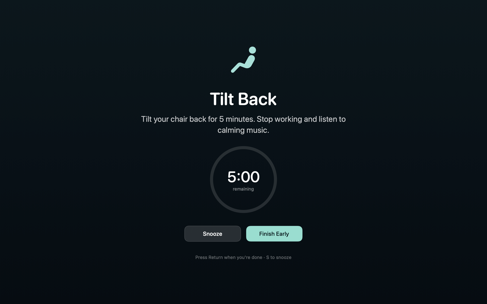
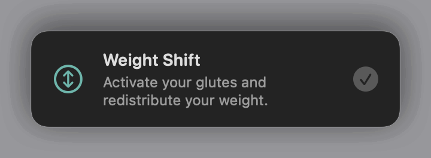
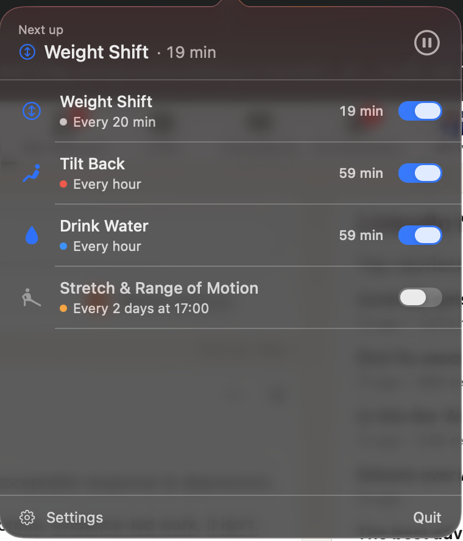
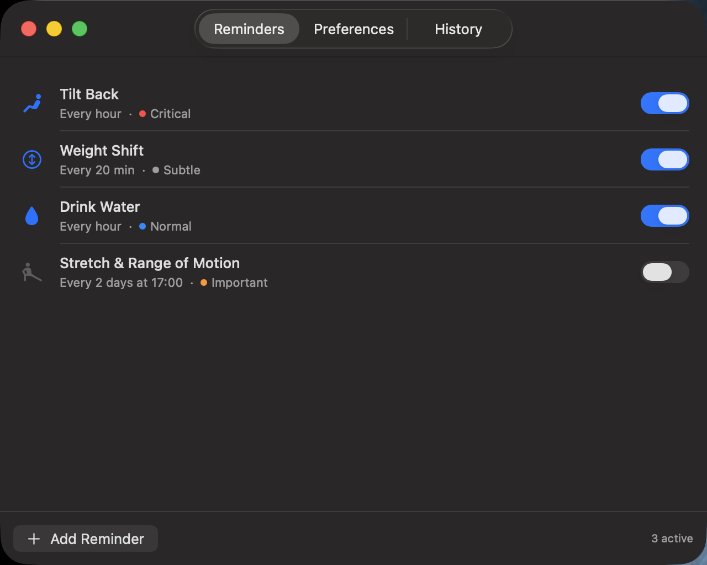
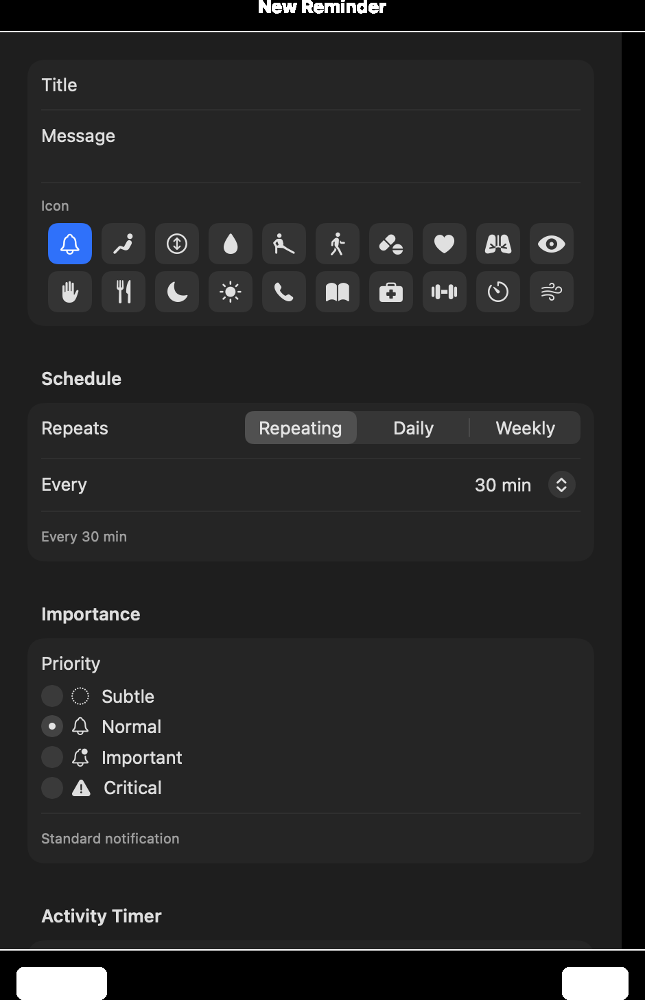

# Reminder

A macOS menu bar app for recurring activity reminders, where how *loudly* a
reminder interrupts you is something you choose per reminder.

It was built for a wheelchair user who needs regular pressure relief, so the
central idea is that a medically important prompt and a nice-to-have nudge
should not feel the same. It works just as well for anyone who wants to drink
water, stretch, take medication, or call their mum every Sunday.

Everything is stored locally. There is no account, no sync, and no network
code in the app at all.

---

## Critical reminders take over the screen

The hourly tilt reminder is the reason this app exists. It dims every display
and stays there until you acknowledge it, with a countdown so "stop working for
five minutes" is a finite thing rather than an open-ended instruction.

<p align="center">
  
</p>

## Subtle reminders stay out of the way

The 20-minute weight shift nudge is the opposite: a small card in the corner
that never steals focus and fades away on its own. Frequent reminders have to
be quiet, or you learn to ignore them.

<p align="center">
  
</p>

## Everything at a glance

Clicking the menu bar icon shows what is coming and when. You can tick something
off, flick a reminder on or off, or pause everything.

<p align="center">
  
</p>

## Managing your reminders

<p align="center">
  
</p>

## Adding your own

Give it a name, pick an icon, choose how often it repeats and how much it should
interrupt you. Each priority explains what it will actually do, so the choice is
not a guess.

<p align="center">
  
</p>

---

## Priority tiers

| Tier | Presentation |
|---|---|
| **Subtle** | A small silent card in the corner that fades away by itself |
| **Normal** | A standard notification |
| **Important** | A notification with sound, marked time-sensitive |
| **Critical** | A full-screen overlay on *every* display, until you acknowledge it |

## Schedules

- **Repeating** — every N minutes, measured from the last time it fired
- **Daily** — at a set time, every N days (so "every second day" stays in phase)
- **Weekly** — at a set time on chosen weekdays

Reminders with a set duration show a countdown while you do the activity.

## What ships by default

| Reminder | Schedule | Tier |
|---|---|---|
| Tilt Back | Every hour, 5-minute countdown | Critical |
| Weight Shift | Every 20 minutes | Subtle |
| Drink Water | Every hour | Normal |
| Stretch & Range of Motion | Every 2 days at 17:00 | Important (off by default) |

All of them can be edited or deleted, and you can add your own.

## Other behaviour

- **Quiet hours**, with an option to let critical reminders through anyway
- **Pause** for 30/60/120 minutes or indefinitely; resuming re-anchors the
  intervals so you do not get a backlog dumped on you at once
- **Snooze**, which is authoritative: it will bring a reminder back even if the
  natural next slot is further away, and it fires late rather than vanishing if
  your Mac was asleep at the moment it was due
- **History and adherence**, showing how often each reminder was completed
- **Launch at login**, since a reminder app you have to remember to start is not
  much of a reminder app

## Requirements

macOS 13 or later.

## Installing

Download the latest release, unzip it, and drag `Reminder.app` to your
Applications folder. The released build is signed and notarized by Apple, so it
opens without a Gatekeeper warning.

macOS will ask for notification permission the first time it runs. If you
decline, or the prompt never appears, the Normal and Important tiers fall back
to the app's own on-screen card — nothing is silently dropped either way. You
can change your mind later in System Settings → Notifications → Reminder.

## Building from source

```sh
./scripts/build_app.sh      # builds dist/Reminder.app, ad-hoc signed
open dist/Reminder.app
```

To sign with your own Developer ID:

```sh
SIGN_IDENTITY="Developer ID Application: Your Name (TEAMID)" ./scripts/build_app.sh
```

### Notarization

macOS will not grant notification authorization to an app it does not fully
trust, so a build for other people needs notarizing:

```sh
xcrun notarytool store-credentials "reminder-notary" \
  --apple-id "you@example.com" --team-id "TEAMID" \
  --password "app-specific-password"

./scripts/notarize.sh
```

An app-specific password is created at
[appleid.apple.com](https://appleid.apple.com) under "App-Specific Passwords".

### Tests

```sh
swift test
```

The scheduling logic is a pure function of `(reminder, now)` with no timers, so
the suite drives a controllable clock. It covers overdue catch-up after the Mac
sleeps, snooze, quiet hours, pause, daylight-saving shifts in both directions,
leap day, and month and year boundaries.

### Icons

`Resources/icon.svg` is the source of truth; the `.icns` and the menu bar
template images are generated from it:

```sh
./scripts/build_icons.sh
```

### Screenshots

```sh
./dist/Reminder.app/Contents/MacOS/Reminder --snapshot build/ui
./dist/Reminder.app/Contents/MacOS/Reminder --open-settings
```

`--snapshot` renders each surface to a PNG, which is easier than trying to
photograph a transient popover.

## Where your data lives

```
~/Library/Application Support/Reminder/data.json
```

Plain JSON — readable, editable, backup-able, and yours.

## Layout

```
Sources/ReminderCore/   Models, scheduler, storage, engine (no UI, fully tested)
Sources/ReminderApp/    Menu bar, overlays, notifications, settings
Tests/                  83 tests against the core
scripts/                Build, notarize, icon generation, rasterizer
```

`ReminderCore` deliberately knows nothing about AppKit: the engine hands fired
reminders to a `ReminderPresenting` protocol, which is what makes the firing
rules testable without a screen.

## Licence

MIT — see [LICENSE](LICENSE).
